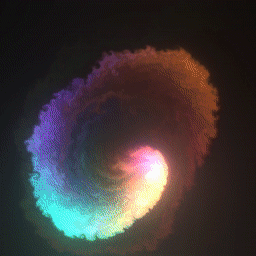

# we-fluid-audio

An audio-reactive WebGL fluid simulation for [Wallpaper Engine](https://www.wallpaperengine.io/), with per-frequency-band color mapping, beat detection, stereo awareness, and layered rendering.

---

## Features

- **6-band frequency split** — sub-bass, bass, low-mid, mid, high-mid, and treble each drive their own splat size and intensity
- **Frequency → color mapping** — each band maps to a configurable hue range (fully customizable per-band color pickers in WE settings)
- **Energy smoothing** — exponential moving average eliminates jittery splat bursts
- **Beat / transient detection** — sharp energy spikes trigger an extra burst of splats with a configurable multiplier
- **Stereo awareness** — left/right channel energies bias splat positions across screen width
- **Band layers** — bass paints to a back layer, mids to a middle layer, treble to the front, so large bass blobs never overwrite fine treble detail
- **Bloom** — configurable intensity and threshold
- All features individually toggleable and tunable from the Wallpaper Engine settings panel

---

## Installation

### Steam Workshop
Subscribe on the Steam Workshop: *(link coming soon)*

### Manual
1. Clone the repo: `git clone https://github.com/davidsrn/we-fluid-audio.git`
2. In Wallpaper Engine, click **Browse** → **My Wallpapers** → **Create Wallpaper** → open `index.html`

---

## Settings reference

| Setting | Type | Description |
|---|---|---|
| Show Mouse Movement | bool | Fluid reacts to mouse movement |
| Splat on Click | bool | Burst of splats on mouse click |
| Use Background Image | bool | Show an image behind the fluid |
| Background Color | color | Canvas background color |
| Audio Responsive | bool | Master toggle for audio reactivity |
| Sound Sensitivity | slider | Overall audio gain (0–10) |
| Frequency Range | slider | Number of bins per band |
| Frequency Range Start | slider | Starting bin offset |
| Smoothing | slider | EMA weight — lower = smoother (0.1–1.0) |
| Beat Detection | bool | Enable burst splats on transients |
| Beat Threshold | slider | Energy delta required to trigger a beat |
| Beat Burst Multiplier | slider | Splat count multiplier on beat hit (1–4×) |
| Stereo Awareness | bool | L/R channel bias splat position |
| Frequency Color Mapping | bool | Per-band hue ranges vs. random colors |
| Dynamic Color Shift | bool | Hues cycle through the rainbow over time |
| Color Shift Speed | slider | How fast the hue cycles (0.01–1.0 cycles/sec) |
| Sub-Bass / Bass / … / Treble Color | color | Hue center for each frequency band |
| Band Layers | bool | Render bass, mid, treble to separate depth layers |
| Per-Band Tuning | bool | Master toggle — reveals per-band controls below |
| Sub-Bass / … / Treble Size | slider | Splat radius multiplier per band (0.1–5×) |
| Sub-Bass / … / Treble Intensity | slider | Splat count multiplier per band (0.1–5×) |
| Sub-Bass / … / Treble Vorticity | slider | Fluid curl per band (0–100); blended by energy |
| Simulation Resolution | combo | Velocity field resolution |
| Dye Resolution | combo | Color field resolution |
| Density Diffusion | slider | How fast colors fade |
| Velocity Diffusion | slider | How fast velocity decays |
| Pressure Diffusion | slider | Pressure solver relaxation |
| Vorticity | slider | Swirl intensity (0–50) |
| Splat Radius | slider | Base splat size |
| Enable Bloom | bool | Glow post-process |
| Bloom Intensity | slider | Bloom brightness (0.01–2) |
| Bloom Threshold | slider | Luminance threshold for bloom (0–1) |
| Random Color | bool | Fully random hue per splat |
| Paused | bool | Freeze simulation |
| Ignore FPS Limit | bool | Uncap frame rate |

---

## Credits

- [PavelDoGreat/WebGL-Fluid-Simulation](https://github.com/PavelDoGreat/WebGL-Fluid-Simulation) — original WebGL fluid simulation (MIT)
- [Delivator/WebGL-Fluid-Simulation](https://github.com/Delivator/WebGL-Fluid-Simulation) — Wallpaper Engine port and settings panel
- [fuchst](https://github.com/fuchst) — FPS limiter

---

## License

MIT — see [LICENSE](LICENSE).  
This project is a derivative work. The original copyright notice must be retained in all copies.
